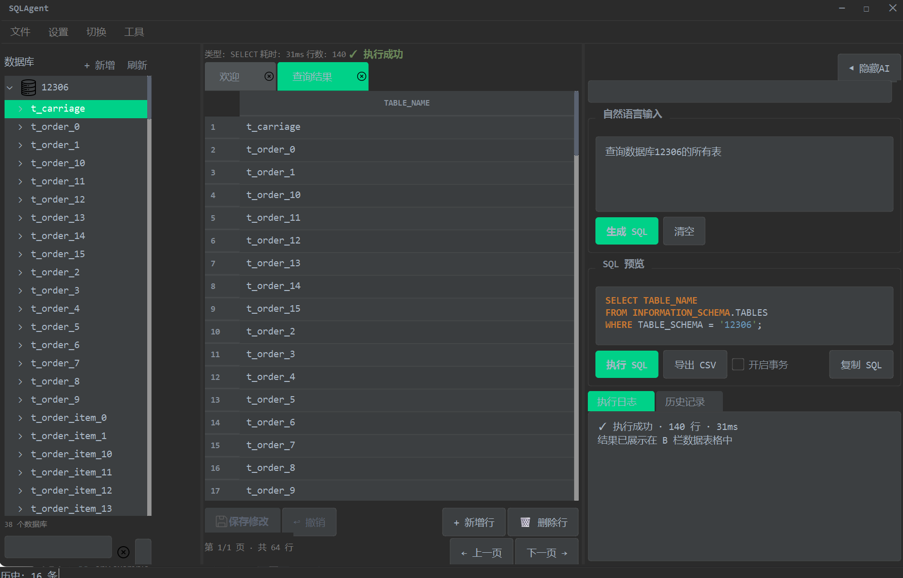
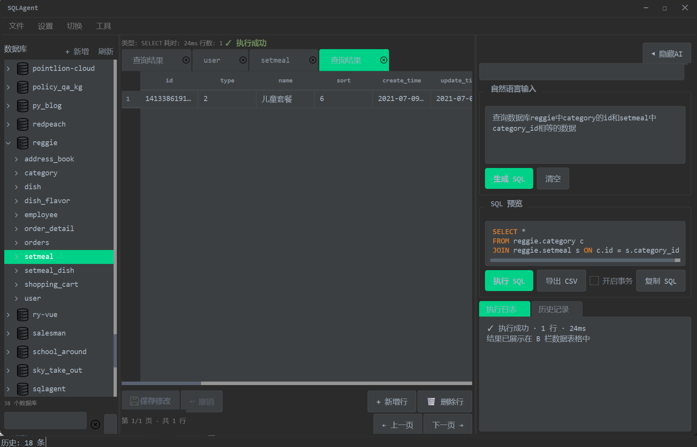
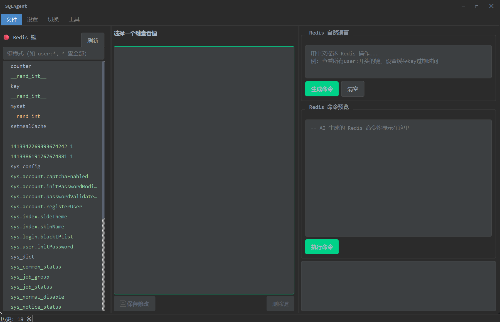

<div align="center">


# 🐸 箭毒蛙 Poison Dart Frog

### 下一代 AI 原生数据库桌面管理工具

[](https://python.org)
[](https://doc.qt.io/qtforpython-6/)
[](https://fastapi.tiangolo.com)
[](https://langchain.com)
[](https://mysql.com)
[](https://redis.io)
[](https://docker.com)
[](LICENSE)
[](https://github.com/huangboyuan-123/poison-dart-frog)

**中文** | [English](#)

</div>

---

## 🔥 为什么选择箭毒蛙？

**用中文写 SQL 的时代来了。从现在开始，你不再需要记住任何 SQL 语法。**

想象一下：你打开数据库工具，在输入框里敲下一句 _"帮我查一下工程部有多少员工，他们的平均工资是多少，按入职时间排序"_，然后 AI 在 3 秒内自动完成以下所有操作：

1. 自动扫描数据库结构，找到 `employees` 表和 `departments` 表
2. 自动分析两表之间的外键关系 `employees.department_id → departments.id`
3. 自动生成 JOIN 查询：`SELECT e.*, AVG(e.salary) OVER() FROM employees e JOIN departments d ON e.department_id = d.id WHERE d.name = 'Engineering' ORDER BY e.hire_date`
4. 自动执行查询，返回可视化表格结果
5. 自动用中文总结："工程部共有 42 名员工，平均工资 ¥15,800，入职最早的员工是 2019 年 3 月..."

**这就是箭毒蛙的能力。** 这不是未来，这是现在你就能用的工具。

箭毒蛙的命名灵感来源于自然界最美丽的蛙类——箭毒蛙（Poison Dart Frog）。它们在热带雨林中色彩鲜艳、行动敏捷、捕食精准。正如我们的工具：在数据的热带雨林中，用 AI 的精准"毒液"一击命中你需要的答案。

---

## 📖 目录

- [为什么选择箭毒蛙？](#-为什么选择箭毒蛙)
- [核心特性](#-核心特性)
- [技术架构](#-技术架构)
- [快速开始](#-快速开始)
- [安装指南](#-安装指南)
- [使用指南](#-使用指南)
- [API 文档](#-api-文档)
- [配置参考](#-配置参考)
- [Docker 部署](#-docker-部署)
- [开发指南](#-开发指南)
- [常见问题](#-常见问题)
- [更新日志](#-更新日志)
- [路线图](#-路线图)
- [贡献指南](#-贡献指南)
- [特别鸣谢](#-特别鸣谢)

---

## ✨ 核心特性

### 🤖 AI 智能引擎

箭毒蛙内置了基于 LangChain 的 AI Agent，支持 DeepSeek、OpenAI 以及任何兼容 OpenAI API 接口的大语言模型。

**工作流程**：

```
用户自然语言输入
    │
    ▼
AI 分析意图（"他想查什么？"）
    │
    ▼
自动扫描数据库结构（list_tables → get_table_schema）
    │
    ▼
AI 生成 SQL（基于真实表结构，不会编造字段名）
    │
    ▼
SQL 语法验证（EXPLAIN 检查）
    │
    ▼
执行查询（只读模式，保护数据安全）
    │
    ▼
中文总结结果（数据 + 分析 + 洞察）
```

**支持的数据库操作**：

| 操作 | 示例输入 | AI 生成 |
|------|---------|---------|
| 查询 | "查询本月销售额最高的10个产品" | `SELECT product, SUM(amount) FROM orders WHERE month=... GROUP BY product ORDER BY SUM(amount) DESC LIMIT 10` |
| 统计 | "统计每个部门的员工人数和平均工资" | `SELECT dept, COUNT(*), AVG(salary) FROM employees GROUP BY dept` |
| 多表关联 | "查询购买了笔记本电脑的用户信息" | `SELECT u.* FROM users u JOIN orders o ON u.id=o.user_id JOIN products p ON o.product_id=p.id WHERE p.name LIKE '%笔记本%'` |
| 数据修改 | "把张三的邮箱改成 zhangsan@new.com" | `UPDATE users SET email='zhangsan@new.com' WHERE name='张三'` |
| 表设计 | "给 users 表添加一个 phone 字段" | `ALTER TABLE users ADD COLUMN phone VARCHAR(20)` |
| 跨库查询 | "查询 h 数据库里 info 表的数据" | `SELECT * FROM h.info` |

**流式思考过程**：所有 AI 推理过程实时可见——你可以看到 AI 如何一步步思考、调用哪些工具、如何生成最终 SQL。这在调优提示词和排查问题时非常有用。

---

### 🗄️ Navicat 级数据管理

箭毒蛙不仅是一个 AI 对话工具，更是一个功能完备的数据库管理客户端。

**数据浏览与编辑**：
- 📊 **多 Tab 数据浏览**：每次查询或点击表名都在新标签页打开，可独立关闭、拖拽排序
- ✏️ **内联单元格编辑**：双击任意单元格直接编辑，自动检测主键生成 UPDATE 语句
- 💾 **批量保存**：修改任意多个单元格后，一键保存所有变更，自动生成参数化 SQL
- ↩️ **撤销修改**：所有未保存的编辑可一键撤销，恢复到数据库原始值
- ➕ **新增行**：弹窗表单填写各列值，自动 INSERT
- 🗑️ **删除行**：选中行 → 右键删除 → 确认弹窗 → DELETE ... WHERE pk=...

**表结构设计器**：
- 📐 **可视化列编辑器**：双击单元格修改列名、类型、默认值、是否可空
- ➕ **添加列**：一键添加新列，自动生成 `ALTER TABLE ADD COLUMN`
- 🗑️ **删除列**：选中列直接删除（二次确认防误删）
- 🔑 **主键/外键识别**：自动标注 PRIMARY KEY 和 FOREIGN KEY

**排序与筛选**：
- 🔼🔽 **表头点击排序**：点击任意表头切换 ASC/DESC，自动追加 `ORDER BY`
- 🔍 **右键列筛选**：右键点击任意列 → `筛选 = xxx` → 自动追加 `WHERE`
- 🧹 **一键清除筛选**：右键菜单清除所有排序和筛选条件

**外键数据跳转**：
- 🔗 **FK 列蓝色渲染**：外键列自动标注为蓝色，鼠标悬停显示目标表名
- 🖱️ **点击跳转**：点击 FK 值，自动打开目标表的对应行（如：点击 `orders.user_id=5` → 打开 `users` 表 `id=5` 的行）

**导入导出**：
- 📥 **导入**：CSV / Excel (.xlsx) / JSON → 自动映射列 → 批量 INSERT
- 📤 **导出**：CSV（UTF-8 BOM）/ Excel（蓝色表头样式 + 数据）

---

### 🎨 PyCharm Darcula 暗色主题

箭毒蛙的 GUI 采用了 JetBrains PyCharm 的经典 Darcula 配色方案，为长时间编码和数据工作提供最舒适的视觉体验。

**配色详情**：

| 元素 | 色值 | 用途 |
|------|------|------|
| 背景 | `#2B2B2B` | 主窗口背景 |
| 面板 | `#3C3F41` | 侧边栏、标签页、卡片 |
| 输入框 | `#3C3F41` | 文本输入、下拉框 |
| 强调色 | `#00BFA5` | 按钮、选中、链接（箭毒蛙青绿） |
| 文字 | `#A9B7C6` | 正文内容 |
| 辅助文字 | `#808080` | 说明、占位符 |
| 成功 | `#6A8759` | 执行成功提示 |
| 错误 | `#BC3F3C` | 执行失败提示 |

**SQL 语法高亮**（PyCharm Darcula 标准）：

| 元素 | 色值 | 示例 |
|------|------|------|
| 关键字 | `#CC7832` 橙色加粗 | `SELECT`, `FROM`, `WHERE` |
| 字符串 | `#6A8759` 绿色 | `'hello world'` |
| 数字 | `#6897BB` 蓝色 | `42`, `3.14` |
| 注释 | `#808080` 灰色斜体 | `-- 这是一条注释` |

**字体**：优先使用 `JetBrains Mono`，回退到 `Cascadia Code` / `Consolas`，中文使用 `Microsoft YaHei`。

**窗口特性**：
- 🪟 **无边框圆角窗口**：10px 圆角 + 抗锯齿渲染
- 🖱️ **边缘拉伸**：4px 边缘检测，拖拽即调整窗口大小
- ↔️ **四栏可拖拽分隔线**：A/B/C/D 四栏宽度自由调整
- 🔝 **自定义标题栏**：Darcula 配色，─ □ ✕ 按钮

---

### 🔴 Redis 全功能支持

箭毒蛙是国内少数同时支持 MySQL 和 Redis 的桌面管理工具。

**键值浏览**：
- 🌳 **层级化键树**：自动按 `:` 分隔符构建层级树（如 `user:1:profile → user → 1 → profile`）
- 🎨 **类型着色**：String=绿色, Hash=橙色, List=蓝色, Set=红色, ZSet=黄色
- 🔍 **模式过滤**：输入 `user:*` 只显示匹配的键

**值查看与编辑**：
- 👁️ **全类型支持**：String / Hash / List / Set / ZSet 自动识别并以易读格式展示
- ✏️ **在线编辑**：修改值后点击保存即写入 Redis
- 🗑️ **删除键**：右键菜单删除，确认弹窗防误删

**AI 命令生成**：
- 🤖 **自然语言 → Redis 命令**："查询所有 user 开头的键"→ `KEYS user:*`
- 🔒 **类型安全拦截**：自动检测键类型，Hash 不会用 GET 误查

---

## 📸 运行截图

<p align="center">
  
  &nbsp;&nbsp;
  
</p>

<p align="center">
  
</p>

---

## 🏗️ 技术架构

```
┌──────────────────────────────────────────────────────────┐
│                     PySide6 桌面端                         │
│                                                          │
│  ┌─────────┬──────────────┬──────────────┬─────────────┐ │
│  │  A 栏   │   B 栏       │   C 栏        │  D 栏       │ │
│  │ 数据库树│  数据浏览器   │  AI 助手      │  思考过程    │ │
│  │         │              │               │  (可折叠)   │ │
│  │  📊 🗄️  │  📋 📊 ✏️    │  💬 🤖 ⚡    │  💭 📝      │ │
│  └─────────┴──────────────┴──────────────┴─────────────┘ │
│                                                          │
│  QThread 异步请求  │  QSyntaxHighlighter 语法高亮         │
│  Signal/Slot 线程安全  │  QPainter 抗锯齿圆角              │
└──────────────────────┬───────────────────────────────────┘
                       │ HTTP REST API (localhost:8000)
┌──────────────────────▼───────────────────────────────────┐
│                     FastAPI 后端                          │
│                                                          │
│  Routers:                                                │
│  ├── /api/query      ← AI 自然语言 → SQL                 │
│  ├── /api/execute    ← 直接执行 SQL                      │
│  ├── /api/schema     ← 数据库结构                        │
│  ├── /api/table      ← 表 CRUD + DDL                     │
│  ├── /api/redis      ← Redis 键值操作 + AI               │
│  └── /health         ← 健康检查                          │
│                                                          │
│  LangChain Agent ←→ OpenAI-Compatible LLM (DeepSeek etc) │
│  SQLAlchemy ←→ PyMySQL                                   │
│  redis-py ←→ Redis Server                                │
└──────────────────────┬───────────────────────────────────┘
                       │
┌──────────────────────▼───────────────────────────────────┐
│              MySQL 8.0  │  Redis 7.0                      │
└──────────────────────────────────────────────────────────┘
```

**分层说明**：

| 层 | 技术栈 | 职责 |
|---|--------|------|
| **桌面 GUI** | PySide6 + Qt 6.5 | 用户交互、数据展示、表格编辑、Markdown 渲染 |
| **API 网关** | FastAPI + Uvicorn | RESTful 接口、参数校验、CORS、流式 SSE |
| **AI 引擎** | LangChain + DeepSeek/OpenAI | 工具调用链、提示词管理、流式输出 |
| **数据访问** | SQLAlchemy + PyMySQL + redis-py | 连接池、参数化查询、类型安全拦截 |
| **数据存储** | MySQL 8.0 + Redis 7.0 | 关系型数据 + 键值缓存 |

---

## 🚀 快速开始

### 环境要求

| 依赖 | 最低版本 | 推荐版本 | 说明 |
|------|---------|---------|------|
| Python | 3.9 | 3.11 | 3.9 兼容，3.11 性能最优 |
| MySQL | 5.7 | 8.0 | 或 Docker 自动安装 |
| Redis | 6.0 | 7.0 | 可选，仅在需要 Redis 功能时 |
| Git | 2.0 | 最新 | 克隆项目 |
| Docker | 20.10 | 最新 | 可选，容器化部署 |

### 安装

```bash
# 1. 克隆仓库
git clone https://github.com/huangboyuan-123/poison-dart-frog.git
cd poison-dart-frog

# 2. 创建虚拟环境（推荐）
python -m venv .venv

# Windows 激活
.venv\Scripts\activate

# macOS/Linux 激活
source .venv/bin/activate

# 3. 安装依赖
pip install -e ".[desktop]"

# 4. 配置 API Key
cp .env.example .env
# 编辑 .env，填入：
#   DEEPSEEK_API_KEY=sk-xxxxxxxx
#   MYSQL_PASSWORD=your_password
#   MYSQL_HOST=localhost
```

### 启动

**方式一：一键启动（推荐）**

```bash
# Windows
start.bat

# macOS/Linux
bash start.sh
```

**方式二：手动启动**

```bash
# 终端 1：启动后端
uvicorn sqlagent.main:app --host 0.0.0.0 --port 8000 --reload

# 终端 2：启动桌面端
python src/sqlagent/desktop_app.py
```

**方式三：Docker 部署（无需安装 Python）**

```bash
docker compose up -d
```

启动后：
- 🌐 API 文档：http://localhost:8000/docs
- 🩺 健康检查：http://localhost:8000/health

---

## 📘 使用指南

### 1. 连接数据库

首次启动后：
1. 点击首页 **🐬 MySQL** 卡片
2. 在 A 栏或 C 栏下拉框旁点击 **+ 新增** 按钮
3. 填写连接信息：名称、类型、主机地址、端口、用户名、密码
4. 点击 **测** 按钮验证连接
5. 连接成功后，A 栏自动加载所有数据库和表

> 💡 不需要填写数据库名——箭毒蛙连接到 MySQL 服务器根级别，自动发现所有数据库。

### 2. 浏览数据

**方式一：点击表名**
- 在 A 栏展开数据库 → 点击表名
- B 栏自动打开新标签页，执行 `SELECT * LIMIT 500`

**方式二：AI 查询**
- 在 C 栏输入框输入问题
- 点击「生成 SQL」→ AI 分析表结构 → 生成 SQL → 显示在预览框
- 点击「执行 SQL」→ B 栏显示表格结果
- D 栏实时展示 AI 思考过程

### 3. 编辑数据

- **修改**：双击任意单元格 → 输入新值 → 点击「💾 保存」
- **新增行**：点击「+ 新增行」→ 弹窗填值 → 确定
- **删除行**：选中行 → 点击「🗑 删除行」→ 确认
- **撤销**：点击「↩ 撤销」放弃所有未保存修改

### 4. 设计表

- A 栏右键表名 → 📐 设计表（可视化）
- 双击列名/类型/默认值修改
- 点「+ 添加列」新增
- 选中列点「🗑 删除列」删除
- 点「保存修改」自动生成 ALTER TABLE 并执行

### 5. 排序与筛选

- **排序**：点击表头切换升序/降序
- **筛选**：右键单元格 → 筛选 = xxx
- **清除**：右键 → 清除筛选/排序

### 6. 导入导出

- **导入**：菜单栏 工具 → 导入数据 → 选文件（支持 CSV/Excel/JSON）
- **导出**：菜单栏 工具 → 导出数据 → 选格式（CSV/Excel）

### 7. Redis 操作

- 首页点击 **🔴 Redis** 卡片
- A 栏自动加载键列表（按 `:` 层级展示）
- 点击任意键 → B 栏显示值和类型
- 修改值后点「保存修改」
- C 栏输入自然语言 → AI 生成 Redis 命令

---

## 📡 API 文档

### 查询与执行

```http
POST /api/query
Content-Type: application/json

{
  "question": "查询工程部有多少员工"
}
```

```json
{
  "success": true,
  "question": "查询工程部有多少员工",
  "sql": "SELECT COUNT(*) FROM employees e JOIN departments d ON e.department_id = d.id WHERE d.name = 'Engineering'",
  "answer": "工程部共有 42 名员工。",
  "steps": ["list_tables", "get_table_schema: employees", "get_table_schema: departments", "execute_query: SELECT COUNT(*)..."]
}
```

```http
POST /api/execute
Content-Type: application/json

{
  "sql": "SELECT * FROM users LIMIT 10",
  "read_only": true
}
```

### 表结构

```http
GET /api/databases
GET /api/schema?database=mydb
GET /api/schema/users?database=mydb
```

### 表操作

```http
POST /api/table/update    # 更新行
POST /api/table/insert    # 插入行
POST /api/table/delete    # 删除行
DELETE /api/table/drop?database=x&table=y   # 删表
DELETE /api/table/database/drop?database=x  # 删库
GET /api/table/ddl?database=x&table=y       # 建表DDL
```

### Redis

```http
GET /api/redis/keys?pattern=*
GET /api/redis/key/user:1
POST /api/redis/key/user:1      # 设置值
DELETE /api/redis/key/user:1    # 删除键
POST /api/redis/query           # AI生成命令
POST /api/redis/execute         # 执行命令
```

### 流式端点

```http
POST /api/query/stream    # SSE 流式 AI 思考（逐字推送）
```

### 健康检查

```http
GET /health

{
  "status": "healthy",
  "database": true,
  "llm": true,
  "version": "0.2.0"
}
```

---

## 🔧 配置参考

### 环境变量 (.env)

| 变量 | 默认值 | 说明 |
|------|--------|------|
| `DEEPSEEK_API_KEY` | — | **必填** DeepSeek API Key |
| `OPENAI_API_KEY` | — | 备用 OpenAI Key |
| `LLM_BASE_URL` | `https://api.deepseek.com/v1` | API 地址 |
| `LLM_MODEL` | `deepseek-chat` | 模型名称 |
| `MYSQL_HOST` | `localhost` | MySQL 主机 |
| `MYSQL_PORT` | `3306` | MySQL 端口 |
| `MYSQL_USER` | `root` | MySQL 用户 |
| `MYSQL_PASSWORD` | — | MySQL 密码 |
| `MYSQL_DATABASE` | （空） | 留空可浏览所有库 |
| `REDIS_HOST` | `localhost` | Redis 主机 |
| `REDIS_PORT` | `6379` | Redis 端口 |
| `REDIS_PASSWORD` | （空） | Redis 密码 |
| `LOG_LEVEL` | `INFO` | 日志级别 |

> 💡 也可以在 GUI 菜单栏「设置 → AI 配置」修改 LLM 参数，自动写入 .env 文件。

---

## 🐳 Docker 部署

### 完整部署（MySQL + Redis + API）

```bash
docker compose up -d
```

包含三个容器：
- **frog-api**：FastAPI 后端 (端口 8000)
- **frog-mysql**：MySQL 8.0 (端口 3307)
- **frog-redis**：Redis 7 (端口 6379)

### 仅启动部分服务

```bash
# 只启动 MySQL
docker compose up -d mysql

# 只启动 Redis
docker compose up -d redis

# 只启动 API（不依赖 Docker MySQL/Redis）
docker compose up -d api
```

### 自定义配置

编辑 `.env` 文件修改数据库密码等配置，然后重启：

```bash
docker compose down
docker compose up -d
```

### 数据持久化

数据存储在 Docker Volumes 中：
- `mysql_data`：MySQL 数据库文件
- `redis_data`：Redis AOF 持久化文件

```bash
# 查看数据卷
docker volume ls | grep frog

# 备份数据
docker run --rm -v frog_mysql_data:/data -v $(pwd):/backup alpine tar czf /backup/mysql_backup.tar.gz -C /data .
```

---

## 💻 开发指南

### 项目结构

```
poison-dart-frog/
├── src/sqlagent/
│   ├── desktop/            # PySide6 桌面端（19 个模块）
│   │   ├── dialogs/        # 弹窗（连接配置/表设计器/AI设置）
│   │   ├── panels/         # A/B/C/D 四栏面板（Mixin 模式）
│   │   ├── main_window.py  # 主窗口
│   │   ├── main.py         # 入口（一键启动）
│   │   ├── constants.py    # 颜色常量
│   │   ├── theme.py        # 暗色 QSS 样式表
│   │   ├── highlighter.py  # SQL 语法高亮
│   │   ├── workers.py      # QThread 异步线程
│   │   ├── utils.py        # 工具函数
│   │   └── store.py        # 持久化存储
│   ├── routers/            # FastAPI 路由
│   │   ├── query.py        # AI 查询 + 流式端点
│   │   ├── table.py        # 表 CRUD + DROP
│   │   ├── schema.py       # 数据库结构
│   │   ├── redis_routes.py # Redis 全功能
│   │   └── health.py       # 健康检查
│   ├── agent.py            # LangChain Agent
│   ├── database.py         # MySQL 管理器
│   ├── tools.py            # Agent 工具集（双工具集）
│   ├── prompts.py          # AI 提示词
│   ├── config.py           # 配置管理
│   ├── models.py           # Pydantic 模型
│   └── static/             # 图标资源
├── tests/                  # 单元测试
├── notes/                  # 开发笔记
├── 运行结果/               # 截图
├── Dockerfile              # API 镜像
├── docker-compose.yml      # 完整部署编排
├── docker-entrypoint.sh    # 容器启动脚本
├── start.bat / start.sh    # 一键启动脚本
└── .env.example            # 配置模板
```

### 本地开发

```bash
# 安装开发依赖
pip install -e ".[dev,desktop]"

# 运行测试
pytest

# 代码检查
ruff check src/ tests/

# 类型检查
mypy src/

# 启动后端（热重载）
uvicorn sqlagent.main:app --host 0.0.0.0 --port 8000 --reload
```

### 架构设计原则

1. **主进程/渲染进程分离**：后端 API（FastAPI）和前端 GUI（PySide6）通过 HTTP 通信，可独立部署
2. **Mixin 模式**：面板方法通过 Mixin 类继承到 MainWindow，避免单文件过长
3. **QThread 异步**：所有 HTTP 请求在后台线程执行，Signal/Slot 回主线程更新 UI
4. **参数化查询**：所有 DML 使用 SQLAlchemy `text().bindparams()` 防止 SQL 注入
5. **双工具集**：Agent 查询模式无 execute 工具，生成 SQL 不会自动执行

---

## ❓ 常见问题

**Q: 为什么我的 API Key 显示余额不足？**

A: DeepSeek API 按量计费。去 [platform.deepseek.com](https://platform.deepseek.com) 充值，或在菜单栏「设置 → AI 配置」换一个有效的 Key。

**Q: 连接 MySQL 报错 "Access denied for user root@localhost"？**

A: 密码不对。检查 `.env` 中的 `MYSQL_PASSWORD`，或在菜单栏「设置 → AI 配置」修改。

**Q: 端口 8000 或 3306 被占用？**

A: 8000 是后端端口，3306 是 MySQL 端口。如果本地已有 MySQL，Docker MySQL 用 3307 端口。后端端口可在启动命令中修改：`uvicorn sqlagent.main:app --port 8001`。

**Q: Redis 功能无法使用？**

A: 需要安装并启动 Redis。Docker 快速启动：`docker compose up -d redis`。如果没有 Redis，Redis 功能页面键列表为空——不会报错。

**Q: 怎么更新到最新版本？**

A: `git pull && pip install -e ".[desktop]"`

**Q: 箭毒蛙免费吗？**

A: 完全开源免费（MIT 协议）。AI 功能需要你自己的 API Key（DeepSeek 约 ¥1/百万 token）。

---

## 📝 更新日志

### v0.2.0 (2026-08)

- ✨ **四栏布局**：A(数据库树) + B(数据浏览器) + C(AI助手) + D(思考面板)
- ✨ **Redis 全功能支持**：键浏览、值编辑、AI 命令生成
- ✨ **流式 AI 思考**：SSE 逐字推送 + Markdown 渲染
- ✨ **可视化表设计器**：增删改列，自动生成 DDL
- ✨ **内联数据编辑**：Navicat 式双击编辑 + 批量保存
- ✨ **排序筛选**：表头排序 + 右键筛选
- ✨ **外键跳转**：点击 FK 值直达引用行
- ✨ **导入导出**：CSV/Excel/JSON
- ✨ **Docker 部署**：API+MySQL+Redis 三容器编排
- ✨ **一键启动脚本**：start.bat/sh
- 🎨 **PyCharm Darcula 主题**：2B2B2B 暗色 + 箭毒蛙青绿（#00BFA5）
- 🔒 **安全加固**：参数化查询防注入、高危 SQL 拦截、类型安全检查
- ♻️ **代码重构**：2740 行单文件 → 19 模块子包

### v0.1.0 (2026-07)

- 🎉 项目初始化
- 🤖 LangChain Agent + DeepSeek 集成
- 📊 PySide6 桌面端基础框架
- 🗄️ MySQL Schema 浏览 + SQL 执行
- 💬 自然语言 → SQL 生成

---

## 🗺️ 路线图

- [ ] **PostgreSQL 支持**：pg 数据库连接和管理
- [ ] **SQLite 支持**：本地文件数据库
- [ ] **MongoDB 支持**：NoSQL 文档数据库
- [ ] **SSH 隧道连接**：通过 SSH 连接远程数据库
- [ ] **ER 图生成**：可视化表关系图
- [ ] **数据生成器**：批量生成测试数据
- [ ] **SQL 自动补全**：输入时智能提示表名/列名
- [ ] **多语言支持**：English UI
- [ ] **Web 版本**：浏览器访问的 Web UI
- [ ] **PyInstaller 打包**：一键生成 .exe 可执行文件
- [ ] **插件系统**：扩展更多数据源

---

## 🤝 贡献指南

欢迎提交 Issue 和 Pull Request！

1. Fork 本仓库
2. 创建特性分支：`git checkout -b feature/amazing-feature`
3. 提交更改：`git commit -m 'feat: add amazing feature'`
4. 推送到分支：`git push origin feature/amazing-feature`
5. 提交 Pull Request

**提交规范**（遵循 Conventional Commits）：
- `feat:` 新功能
- `fix:` 修复
- `docs:` 文档
- `style:` 样式
- `refactor:` 重构
- `test:` 测试
- `chore:` 构建/工具

---

## 🙏 特别鸣谢

箭毒蛙站在以下开源项目的肩膀上：

| 项目 | 用途 |
|------|------|
| [PySide6](https://doc.qt.io/qtforpython-6/) | Qt for Python GUI 框架 |
| [FastAPI](https://fastapi.tiangolo.com/) | 高性能 Python Web 框架 |
| [LangChain](https://langchain.com/) | LLM Agent 编排框架 |
| [SQLAlchemy](https://sqlalchemy.org/) | Python SQL 工具包 |
| [DeepSeek](https://deepseek.com/) | 高性价比中文大模型 |
| [redis-py](https://github.com/redis/redis-py) | Redis Python 客户端 |
| [openpyxl](https://openpyxl.readthedocs.io/) | Excel 文件读写 |
| [JetBrains Mono](https://jetbrains.com/lp/mono/) | 开发者字体 |

---

## ⭐ Star History

<picture>
  <source media="(prefers-color-scheme: dark)" srcset="https://api.star-history.com/svg?repos=huangboyuan-123/poison-dart-frog&type=Date&theme=dark" />
  <source media="(prefers-color-scheme: light)" srcset="https://api.star-history.com/svg?repos=huangboyuan-123/poison-dart-frog&type=Date" />
  
</picture>

---

## 📄 开源协议

MIT License © 2026 [会飞的程序源](https://github.com/huangboyuan-123)

**Star 是免费的，但能给我继续更新下去的动力。如果这个项目对你有用，请点亮右上角的 ⭐ Star！**

---

<div align="center">
  <sub>用 ❤️ 和 🐍 在深圳打造 | 箭毒蛙 — AI 原生数据库管理新体验</sub>
</div>
